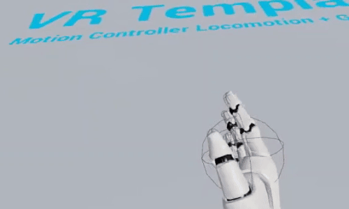
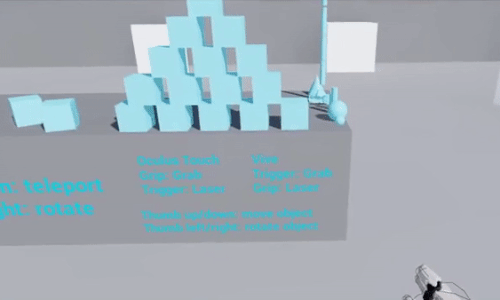
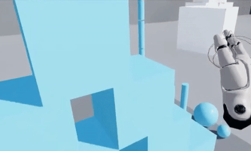
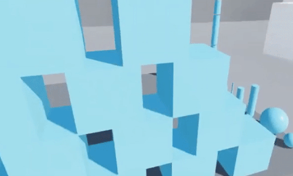
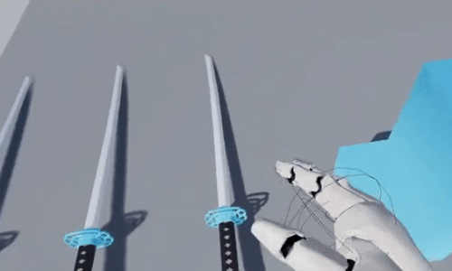
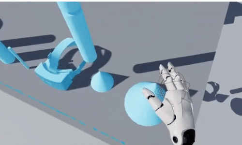

# Expanded UE VR Template

Developed using UE 4.25.3

This is a fork of https://github.com/inugames/basic-vr that further expands and adds Oculus/SteamVR Home interactions and features

# All currently implemented features:

  - :heavy_check_mark: Teleportation - locomotion using teleportation

  - :heavy_check_mark: Turn in place - rotate character in place

  - :heavy_check_mark: Physics Hands - hands cannot pass through walls and interact with physic based objects

  - :heavy_check_mark: Physics pickup - picked up objects with calculated weigth that impacts hands, retains all collisions and interactions with physic based objects

  - :heavy_check_mark: Attachable one hand objects - object that is attached to hand, retains all collisions and interactions with physic based objects

  - :heavy_check_mark: IK Hands - IK on finger when interacting or picking up physics objects

Planned features for future implementation:
  - :construction: Locomotion with collisions
  - :x: HMD collisions (RecRoom inspired)
  - :construction: One handed object pickup with action
  - :x: Two handed object pickup with action
  - :x: Hand gestures

:heavy_check_mark: finished
:x: not yet started
:construction: work in proggress

### Development

Want to contribute? Great!

You can take a task from planned features that isn't tagged started (or you don't see any branch with that task) and start working.

### Contributors

 - @inugames
 - @JJcherrycode

License
----

MIT

